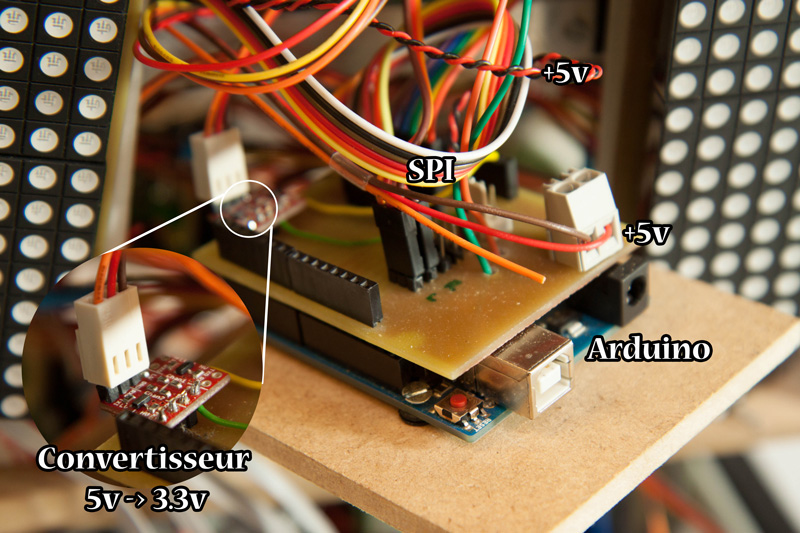
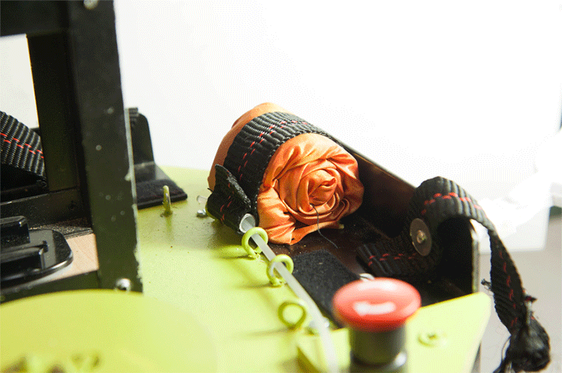
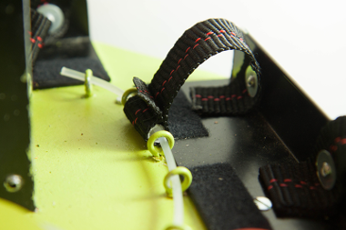
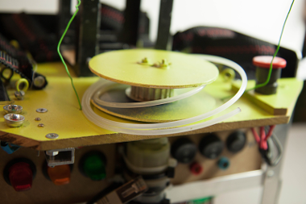
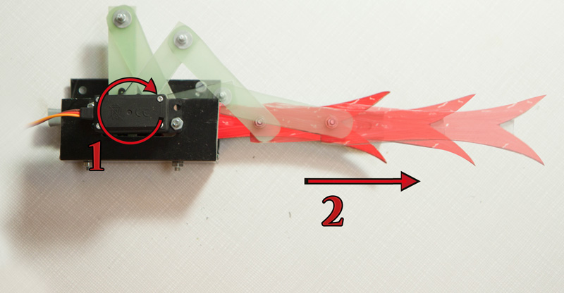
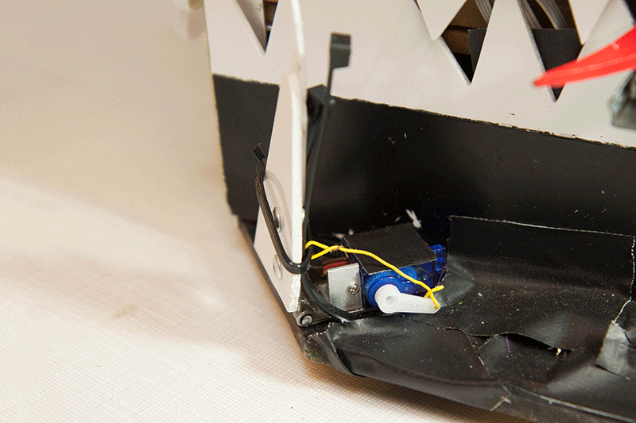
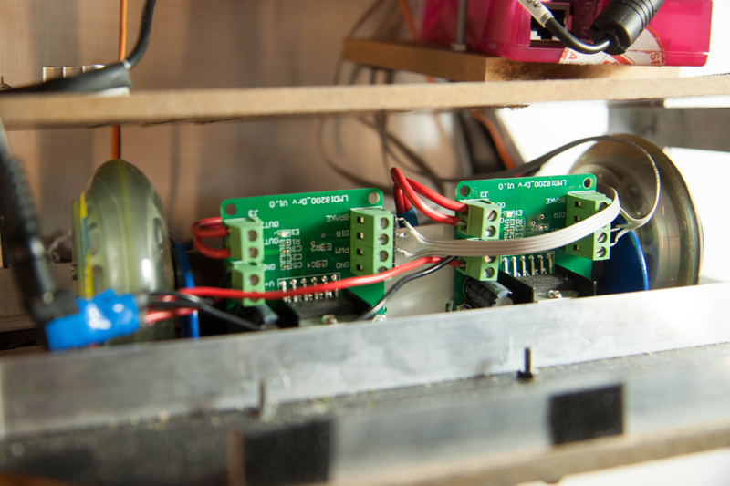

#Règlement :

Les robots, pour leurs 20 ans en France, fêtent leur anniversaire de façon inoubliable. Pour cela plusieurs actions leur sont proposées pour marquer le plus de points possibles auprès de leurs invités : 

 * Les Cadeaux : les robots doivent ouvrir chaque cadeau pour en révéler le contenu. 
 * Les Bougies : les robots doivent souffler un maximum de bougies et coopérer pour en éteindre encore plus. 
 * La Fontaine à jus de fruits : les robots doivent servir des rafraîchissements. 
 * Les Cerises sur le gâteau : les robots doivent envoyer un maximum de cerises sur le haut du gâteau. Attention, tout de même aux fruits pourris ! 
 * La Fiesta : à la fin du match, les robots à l’arrêt, peuvent gonfler des ballons embarqués. (Funny Action)

 

Le règlement complet est disponible ici : [Règlement officiel Eurobot 2013](ReglementEurobot2013FRVersionfinale.pdf)

#Nos objectifs pour cette année :
Cette année nous avions un objectif en tête : *nous amuser* ! 
La victoire n'était pas dans nos priorités, nous voulions avant tout réaliser un robot sympathique, amusant, avec une vraie personnalité. C'est pour cela que nous avons porté une attention toute particulière à l'esthétisme du robot, ainsi qu'à sa capacité à réaliser des choses amusantes (avec la coupe-off en tête dès le début de la conception). 
Cependant, ayant tous participé à une ou plusieurs coupes dans le passé, nous connaissions certains aspects qui permettent de transformer un robot sympa en un robot sympa qui marque des points :

 * *Fiabilité avant tout !* Il vaut mieux concevoir des mécanismes simples, qui ne marqueront pas forcément le maximum de points mais qui marqueront ces points de manière reproductible. Une fois les mécanismes de base rodés, alors on peu commencer à les améliorer en évitant toute régression.
 * *Ne pas se prendre trop au sérieux*, la conception du robot doit rester un divertissement et ne jamais se transformer en corvée. 
>-- Et si on rajoutait des yeux au robot ? 
>-- Mais... cela ne gagne pas de points ! 
>-- Et alors ? C'est fun ! 
 * *Ne pas négliger le déplacement*. Si le robot est capable de partir d'un point A pour aller vers un point B sans (trop) se perdre, alors il pourra marquer des points de manière quasi certaine (pour pousser un cadeau par exemple).

#Résultats :

Les résultats ont été à là hauteur de nos espérances :

* *Un robot sympathique ?*   Mission accomplie !

 	Les beaux yeux de Gobywan, sa chevelure de feu et l'ambiance mise dans les stands par ses concepteurs ont permis à l'équipe de gagner le *Prix Coup De Coeur du Jury*.

* *Marquer des points*   Mission accomplie !

	L'équipe termine *47è* sur 146 équipes, avec 4 matchs gagnés pour 5 matchs joués. C'est pour nous un excellent résultat.

#Le robot : Gobywan

## Le plus important : les yeux !

Ils sont chacun constitués de 2 matrices de 8x8 led RGB.
Les matrices controlés à l'aide d'un Arduino Uno et de plusieurs shift-registers.

## Les cheveux !

>Non mais allô ! T'es un robot t'as pas de cheveux ! Non mais allô quoi !

Pour réaliser la "Funny Action" en fin de match et gagner les points bonus, une rangée de cheveux se dressent sur la te de Gobywan.

Ces cheveux sont en réalité des tubes de tissus remplis de mousse (récupérée dans le coussin d'un vieux canapé). Avant le match ils sont roulé très serré et maintenus par une sangle. 

Lorsque la fin du matche approche, un moteur de visseuse Ikéa [FIXA](http://www.ikea.com/fr/fr/catalog/products/20214199/) enroule un câble qui servait de goupille et libère un à un les cheveux.

<!---
[Article détaillé sur les Cheveux.]()
-->

## Les bras Clap-Clap !

Monté sur des gros servo-moteurs de récup, ils permettent d'appuyer sur les balles de tennis ou encore de pousser les cadeaux.

## La langue de serpent et les petites dents pointues !

Utilisée pour pousser les cadeaux et intimider l'adversaire, la langue est constituée d'une glissière de tiroir, d'un servomoteur de modélisme et de quelques bielles en époxy.

Les dents, servant à canaliser un peu les gobelets, se déploients vers l'avant.

## La base roulante.

Elément essentiel du robot, elle est constituée d'un plaque en médium sur laquelle vient se fixer deux moteurs GoTronic assortis de roue de rollers.

<!---
[Tous les détails sur la page dédiée !]()
-->

##Électronique/Informatique
###Le coeur du robot : Carte mère et RaspberryPi

L'intelligence artificielle, qui coordonne l'ensemble des carte et actionneurs, est situé sur une carte RaspberryPi qui fait tourner un système linux personnalisé .

Ce "mini-pc" et directement relié a une carte mère réalisée sur mesure. Elle comporte différents modules.

####Une alimentation à découpage 5V
Pour alimenter la Raspberry Pi, les microcontroleurs ainsi que les différents capteurs.
Cette petite carte accepte une tension comprise entre 5 et 35V en entrée et peut générer une tension réglable entre TODO et TODO par 2 résistances.

####Interface Raspberry Pi

####Deux microcontroleurs AVR ATMEGA328

####De nombreuses entrées/sorties

###Puissance

Pour piloter les deux roues motrices, nous utilisons 2 cartes basées sur le pont en H lm18200.
Ces cartes ont été achetées montées sur eBay. Cela revenant au final moins cher que d'acheter les composants séparément et de réaliser la carte nous même. 
Nous utilisons ces pont en H avec succès depuis plusieurs années. Le seul défaut que nous leur avons trouvé : la tension d'alimentation des moteurs doit être supérieur à 12V, sans quoi le pont en H ne fonctionne pas. Afin de ne pas rencontrer de problèmes avec nos moteurs 12V nous avons alimenté les ponts en H en 15V, on prenant garde de ne jamais mettre le pwm des moteurs à 100% pour limiter la tension moyenne à leurs bornes. C'est une pratique un peu risquée, une trop forte surtension risque de griller les moteurs, cependant aucun accident n'a eu lieu jusqu'à ce jour.

###Batteries

Nous avons utilisé deux jeux de 3 batteries LiPO 2S. 
Durant un match, deux batteries en série sont utilisée pour alimenter les différents moteurs tandis que la 3ème aliment l'électronique de controle ainsi que les capteurs.

Nous avions deux cartes permettant de transformer le 7 ou le 14v des batteries en 5V pour l'électronique et les servomoteurs.

<!---
Tous les détails sur la page dédiée !]()
-->

 Il est important de bien séparer le "contrôle" (Raspberry Pi, capteurs...) de la puissance (moteurs) pour éviter les parasites.

##"Intelligence Artificielle"