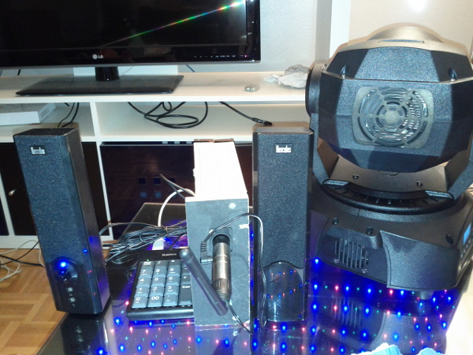

#Qui :
Cassou, sur commande de [Damien Aspe](http://damienaspe.free.fr/)

#Le projet :

Dans le cadre d'une exposition en [novembre 2013](http://www.morsang.fr/spip.php?article14131), [Damien Aspe](http://damienaspe.free.fr/) a confié à l'équipe GobGob la conception et réalisation technique de son oeuvre 3D Map.

En moins d'un mois, il fallait mettre au point un système compacte permettant de piloter une lyre (projecteur contrôlable en dmx, voir plus bas) avec une souris optique.
Le gobo, sorte de cache permettant de choisir l'image projetée, aura la forme d'une flèche, rappelant un pointeur de souris.

L'objectif final étant de pouvoir contrôler un pointeur géant sur les murs d'une salle du Chateau de Morsang.

Voici un aperçu du résultat (explication techniques en dessous): 

<iframe width="560" height="315" src="//www.youtube.com/embed/xdJqa_kmdRo" frameborder="0" allowfullscreen="allowfullscreen">Youtube</iframe>

#Le système

Le temps étant compté, nous avons été au plus rapide et sommes resté dans des technos maitrisées et disponibles dans nos tiroirs. 
La gestion de la souris est assurée par un programme en python tournant sur une carte [Raspberry Pi](http://fr.wikipedia.org/wiki/Raspberry_Pi).

La génération des signaux dmx est prise en charge par une carte [Arduino Uno](http://fr.wikipedia.org/wiki/Arduino) assortis d'un shield fait maison. Les deux cartes communiquant entre elles par une liaison série.

Afin d'éviter de devoir tirer un câble jusqu'au projecteur, un couple de transmetteur-récepteur DMX sans fils a été acheté.

(Suite a venir)

##Arduino

##Raspberry Pi

##Lyre et transmetteur DMX sans fil.

